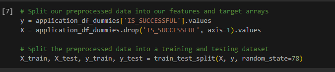
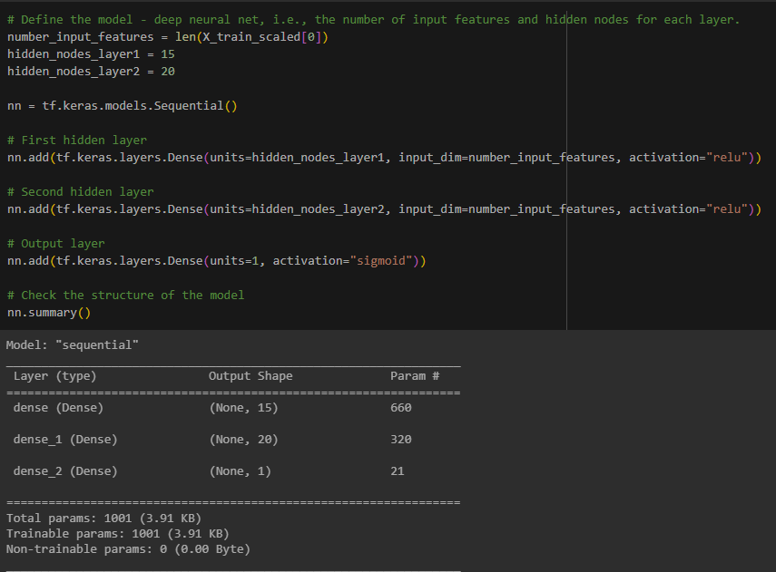
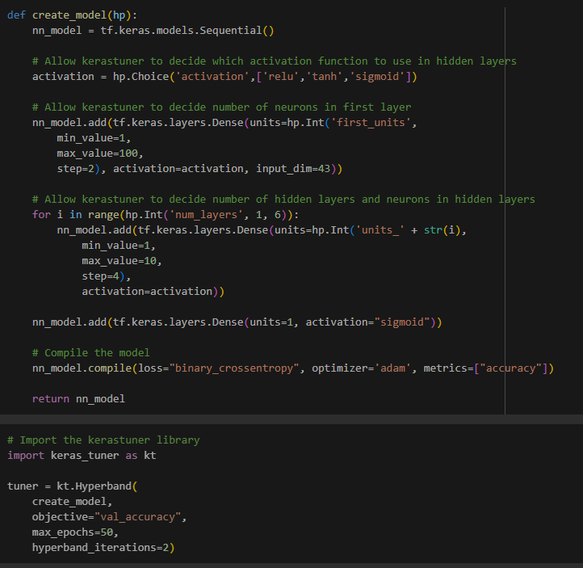

# deep-learning-challenge

# Neural Network Model Report

# Overview
    The goal of this analysis is to get over 75% accuracy given the following data:
    
    The nonprofit foundation Alphabet Soup wants a tool that can help it select the applicants for funding with the best chance of success in their ventures. With your knowledge of machine learning and neural networks, you’ll use the features in the provided dataset to create a binary classifier that can predict whether applicants will be successful if funded by Alphabet Soup.

    From Alphabet Soup’s business team, you have received a CSV containing more than 34,000 organizations that have received funding from Alphabet Soup over the years. Within this dataset are a number of columns that capture metadata about each organization, such as:

    EIN and NAME—Identification columns
    APPLICATION_TYPE—Alphabet Soup application type
    AFFILIATION—Affiliated sector of industry
    CLASSIFICATION—Government organization classification
    USE_CASE—Use case for funding
    ORGANIZATION—Organization type
    STATUS—Active status
    INCOME_AMT—Income classification
    SPECIAL_CONSIDERATIONS—Special considerations for application
    ASK_AMT—Funding amount requested
    IS_SUCCESSFUL—Was the money used effectively

# Results
    *Data Preprocessing

    The target variable used is: IS_SUCCESSFUL 

    

    The features variables for the models are:
    APPLICATION_TYPE
    AFFILIATION
    CLASSIFICATION
    USE_CASE
    ORGANIZATION
    STATUS
    INCOME_AMT
    SPECIAL_CONSIDERATIONS
    ASK_AMT

    The variables EIN and Name were removed from the input data because they are neither targets nor features.

    *Compiling, Training, and Evaluating the Model

    Attempt # 1 :  Two layers with random nodes that I chose simply as a place to start.  I didn't want too few, but also not too many, so I chose numbers based on previous models we'd worked on.

    

    It achieved a 72% accuracy, which seemed fairly promising, though not what I wanted.

    Attempt # 2 : I decided to use the Hyperparameters option in Keras Tuner to see if that could give me a better accuracy guage. 

    

    

How many neurons, layers, and activation functions did you select for your neural network model, and why?
Were you able to achieve the target model performance?
What steps did you take in your attempts to increase model performance?

# Summary
    Summarize the overall results of the deep learning model. Include a recommendation for how a different model could solve this classification problem, and then explain your recommendation.